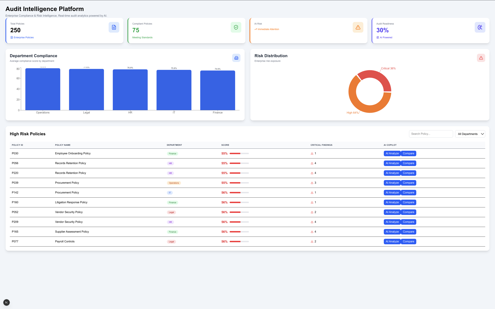
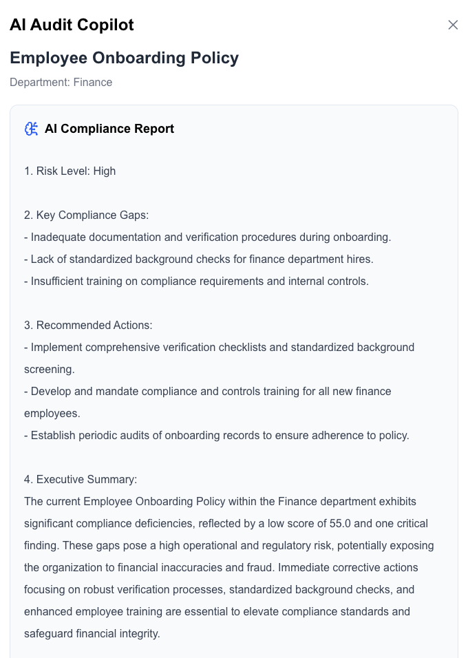
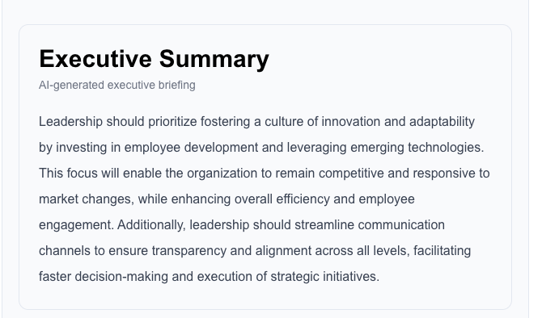
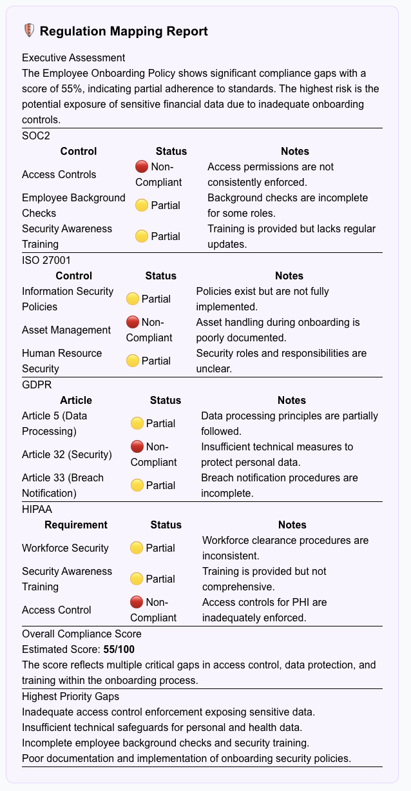
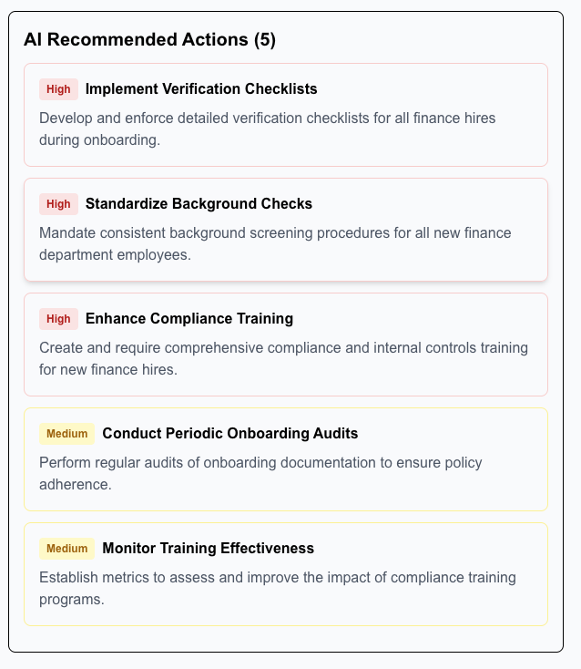
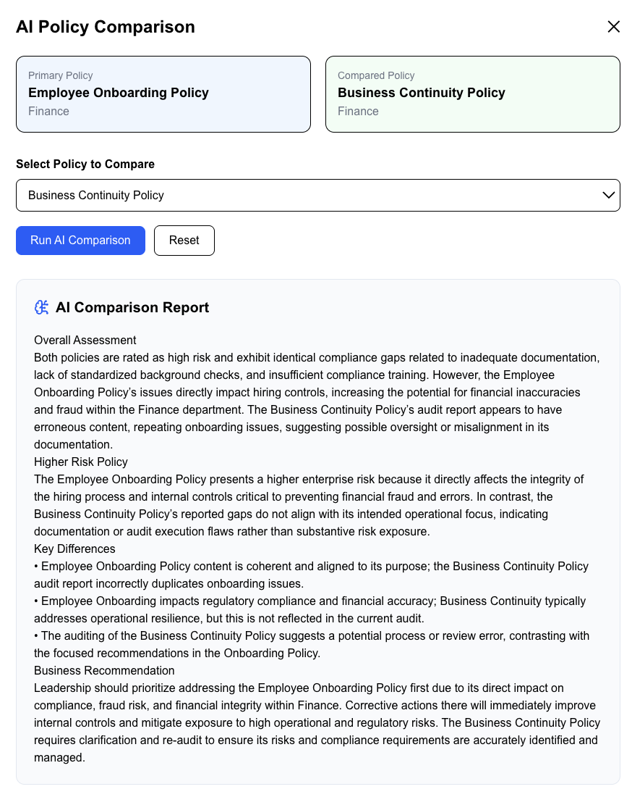
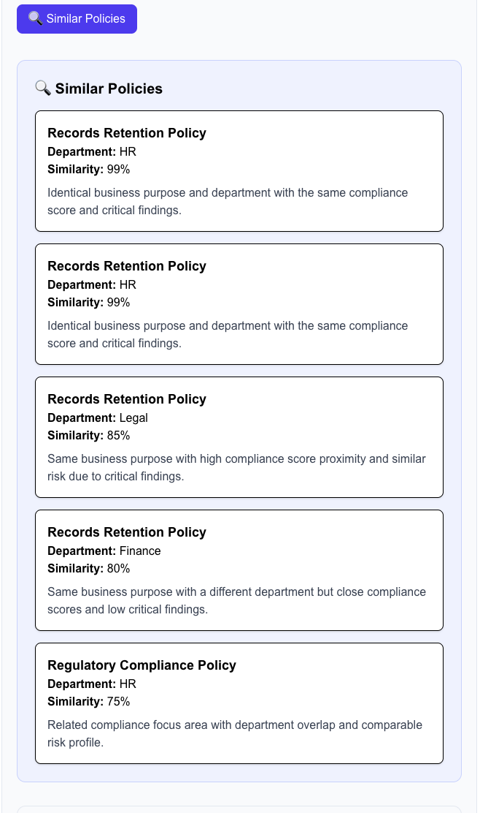
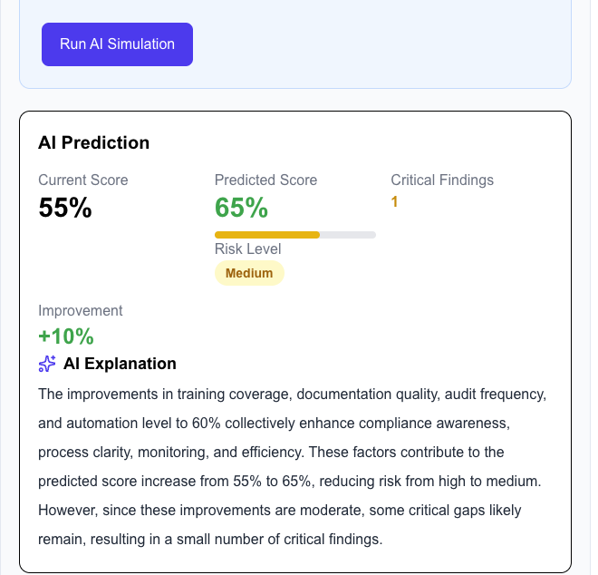
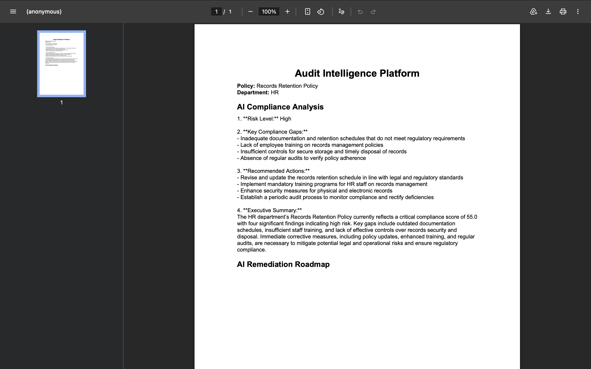

# Audit Intelligence Platform

An AI-powered enterprise audit and compliance platform that automates policy analysis, compliance assessment, and executive reporting using Large Language Models.

Built with **Next.js**, **FastAPI**, **PostgreSQL**, and **OpenAI GPT-4.1 Mini**.

---

## Features

### Dashboard
- Enterprise compliance overview
- Department compliance analytics
- Risk distribution visualization
- High-risk policy monitoring
- Search and filtering

### AI Policy Analysis
- Executive summaries
- Risk assessment
- Critical findings
- Recommended actions

### AI Recommendations
- AI-generated remediation suggestions
- Actionable compliance improvements
- Best-practice recommendations

### Regulation Mapping
Automatically maps enterprise policies against:

- SOC 2
- ISO 27001
- GDPR
- HIPAA

Includes:
- Compliance status
- Regulatory controls
- Gap analysis
- Overall compliance score

### Policy Comparison
Compare two enterprise policies to identify:
- Similarities
- Differences
- Compliance gaps
- Risk impact

### Policy Similarity Search
Find related enterprise policies using AI-generated similarity analysis.

Displays:
- Similarity score
- Department
- AI explanation

### AI Compliance Simulator
Simulate compliance improvements by adjusting:
- Training coverage
- Documentation quality
- Audit frequency
- Automation level

### Executive Report Export
Generate downloadable executive compliance reports.

---

## Tech Stack

### Frontend
- Next.js
- React
- TypeScript
- Tailwind CSS
- Axios
- React Markdown
- Recharts

### Backend
- FastAPI
- Python
- OpenAI API
- Pydantic

### Database
- PostgreSQL

---

## Project Structure

```text
audit-intelligence-platform/
│
├── backend/
│   ├── app/
│   │   ├── services/
│   │   └── main.py
│   ├── requirements.txt
│   └── .env
│
├── frontend/
│   ├── app/
│   ├── public/
│   └── package.json
│
├── data/
├── docs/
└── README.md
```

---

## Getting Started

### Backend

```bash
cd backend

python -m venv .venv
source .venv/bin/activate

pip install -r requirements.txt

uvicorn main:app --reload
```

Backend API:

```
http://localhost:8000
```

Swagger Documentation:

```
http://localhost:8000/docs
```

---

### Frontend

```bash
cd frontend

npm install

npm run dev
```

Frontend:

```
http://localhost:3000
```

---
# Screenshots

## Executive Dashboard



---

## AI Policy Analysis



---

## Executive Summary



---

## Regulation Mapping



---

## AI Recommendations



---

## Policy Comparison



---

## Policy Similarity Search



---

## AI Compliance Simulator



---

## Executive PDF Report




## Future Enhancements

- PDF policy ingestion
- Vector similarity search
- Authentication and role-based access
- Audit history and reporting
- Additional compliance frameworks

---

## Author

**Dhairya Mehta**

MS Software Engineering  
Arizona State University

- GitHub: https://github.com/Dhairyaa442
- LinkedIn: https://linkedin.com/in/dhairyaa442